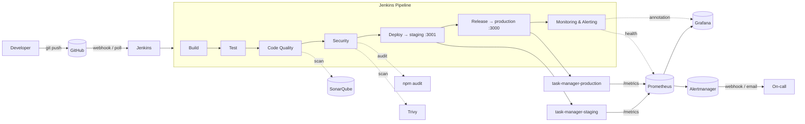

# Architecture

The whole system runs on a single Docker host. Three independent compose
stacks share one Docker network (`devops-net`) so containers can reach each
other by name.

## Containers, by stack

| Stack | Containers | Network |
|---|---|---|
| `docker-compose.jenkins.yml` | `jenkins`, `sonarqube` | `devops-net` |
| `monitoring/docker-compose.monitoring.yml` | `prometheus`, `alertmanager`, `grafana` | `devops-net` |
| `docker-compose.staging.yml` | `task-manager-staging` | `devops-net` |
| `docker-compose.production.yml` | `task-manager-production` | `devops-net` |

## Why this layout

* **One shared network** means Jenkins can talk to SonarQube as
  `http://sonarqube:9000`, Prometheus can scrape `task-manager-production:3000`
  by name, etc — no IP hard-coding.
* **Staging and production are the same image, different env vars** — the
  core principle behind reproducible releases.
* **Monitoring is a long-running stack of its own** so dashboards survive
  across pipeline runs and can correlate releases with metrics.
